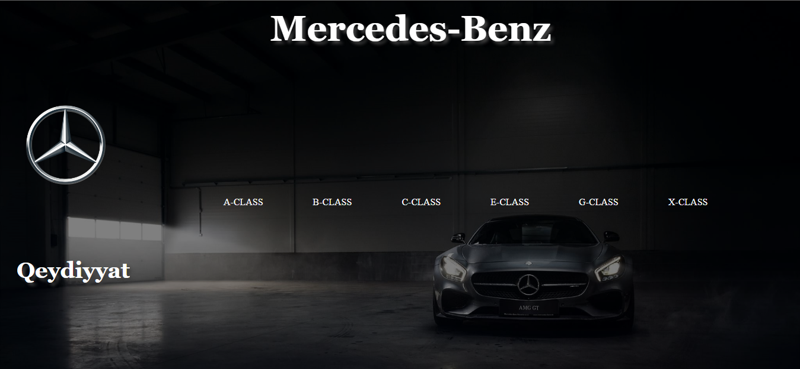
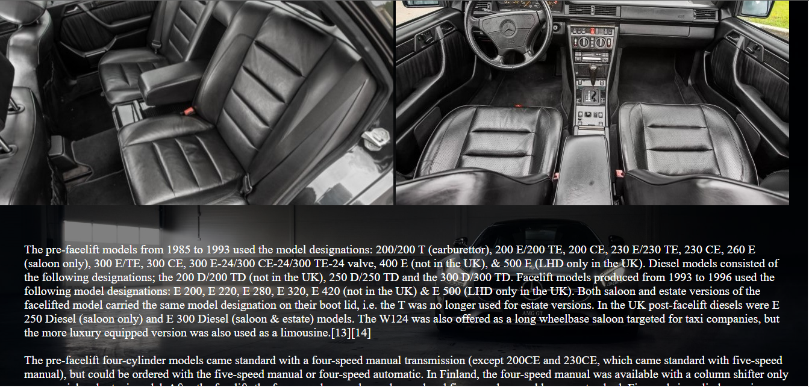
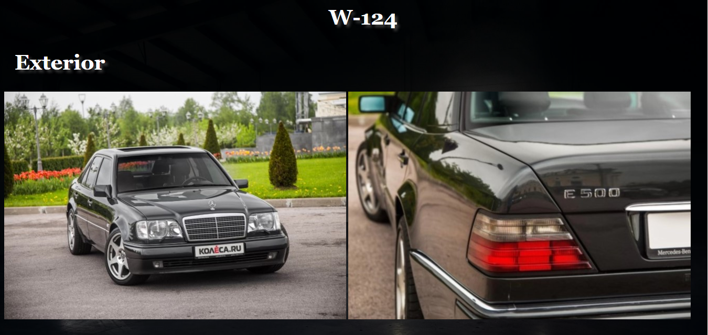

# Mercedes-Benz

## Modellər haqqında müəlumat

[](https://nodesource.com/products/nsolid)


Mercedes-Benz modelləri haqqında müəlumat

- Qeydiyyatdan kecin
- Avtomobil secin
- Avtomobil haqqında müəlumat əldə edin

## Ustunlukler

- Dolğun və dəqiq müəlumat
- Avtomobillərin göstəriciləri
- Satış dilerılərinin ünvanları

## sekiller





> # Qeyd 2.1 
> formating syntax is to make it as readable
> as possible. The idea is that a
> Markdown-formatted document should be
> publishable as-is, as plain text, without
> looking like it's been marked up with tags
> or formatting instructions.


## Baş Dizayner


```sh
Bruno Sacco
```


## Müəlumat

Modellerin isdehsal tarixi

| Model | Istehsal tarixi |
| ------ | ------ |
| W123  | 1975-1987 |
| W124  | 1987-1995 |
| W210  | 1995-2001 |
| W211  | 2001-2009 |
| W212  | 2009-2012 |
| W212R | 2012-2015 |


